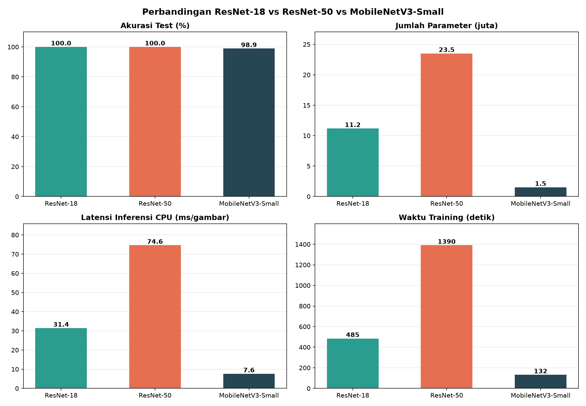
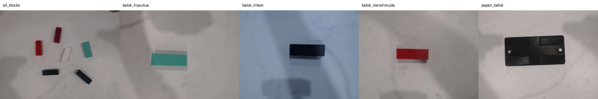
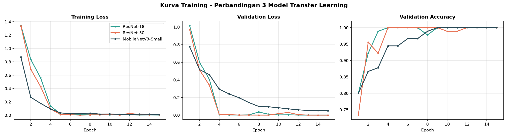
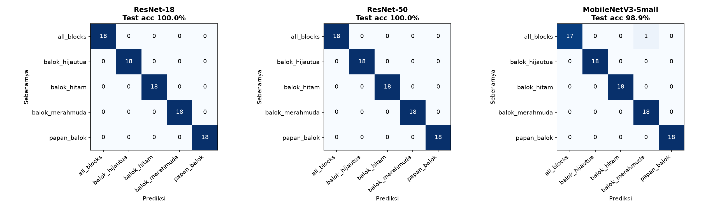
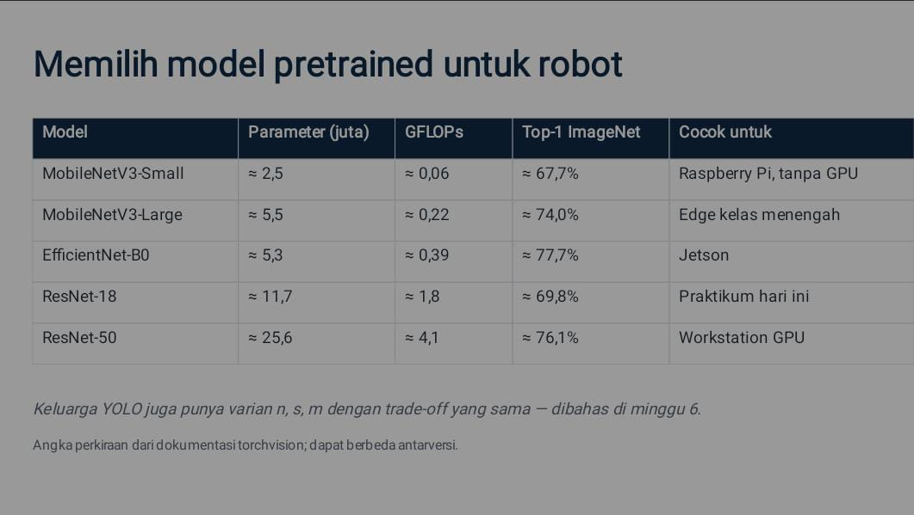

# Klasifikasi Balok dengan Transfer Learning

Perbandingan tiga model pretrained ImageNet — **ResNet-18**, **ResNet-50**, dan **MobileNetV3-Small** — untuk mengklasifikasi 5 kelas objek balok dari citra kamera. Proyek ini dibuat untuk praktikum pemilihan model pretrained pada robot.

## Ringkasan Hasil

| Model | Parameter (juta) | Ukuran file | Val acc | **Test acc** | Latensi CPU | Waktu training |
|---|---:|---:|---:|---:|---:|---:|
| ResNet-18 | 11,2 | 44,8 MB | 100% | **100%** (90/90) | 31,4 ms | 485 dtk |
| ResNet-50 | 23,5 | 94,4 MB | 100% | **100%** (90/90) | 74,6 ms | 1.390 dtk |
| MobileNetV3-Small | 1,5 | 6,2 MB | 100% | **98,9%** (89/90) | 7,6 ms | 132 dtk |



**Kesimpulan singkat**
- Ketiga model sangat akurat pada dataset ini (≥ 98,9%).
- MobileNetV3-Small kehilangan hanya 1 dari 90 gambar test, tetapi sekitar **4× lebih cepat** dari ResNet-18, **10× lebih cepat** dari ResNet-50, dan file-nya 7–15× lebih kecil.
- Untuk robot dengan komputasi terbatas (mis. Raspberry Pi tanpa GPU), **MobileNetV3-Small** adalah pilihan paling masuk akal. ResNet-50 tidak memberi keuntungan akurasi di dataset ini, tetapi paling lambat dan paling berat.

## Dataset

Dataset berisi **600 foto** (640×480 px, JPG) dengan **5 kelas**, masing-masing 120 foto. Detail lengkap ada di [DATASET.md](DATASET.md).



| Kelas | Isi gambar |
|---|---|
| `all_blocks` | Beberapa balok berbagai warna dalam satu gambar |
| `balok_hijautua` | Satu balok hijau tua |
| `balok_hitam` | Satu balok hitam |
| `balok_merahmuda` | Satu balok merah/merah muda |
| `papan_balok` | Papan hitam bertitik (dasar balok) |

Pembagian data (per kelas): **84 train / 18 val / 18 test** (70% / 15% / 15%), sehingga total train 420, val 90, test 90.

## Metode

1. **Model pretrained** dimuat dengan bobot ImageNet (`IMAGENET1K_V1`) dari torchvision. Layer klasifikasi terakhir diganti menjadi 5 kelas.
2. **Training dua fase** (15 epoch):
   - Epoch 1–3: backbone dibekukan, hanya layer terakhir dilatih (*feature extraction*), Adam lr = 1e-3.
   - Epoch 4–15: seluruh layer dibuka (*fine-tuning*), Adam lr = 1e-4 dengan cosine annealing.
3. **Preprocessing**: resize 224×224, normalisasi statistik ImageNet.
4. **Augmentasi** (hanya train): RandomResizedCrop (skala 0,7–1,0), horizontal flip, ColorJitter ringan.
5. **Seleksi model**: bobot dengan akurasi validasi terbaik dievaluasi di test set.
6. **Latensi**: rata-rata 50 kali inferensi 1 gambar di **CPU** setelah warm-up.
7. Seed acak: 42. Loss: CrossEntropy. Batch size: 32.

## Kurva Training



- ResNet-18 dan ResNet-50 mencapai akurasi validasi 100% sejak epoch 4, yaitu setelah fine-tuning dimulai. Loss validasi turun tajam di titik yang sama.
- MobileNetV3-Small konvergen lebih lambat dan mulus; akurasi validasi baru 100% di epoch 9, dan loss validasi masih turun sampai epoch 15 (≈ 0,05).

## Confusion Matrix (Test Set)



ResNet-18 dan ResNet-50 memprediksi seluruh 90 gambar test dengan benar. MobileNetV3-Small hanya salah satu gambar: **`all_blocks` terprediksi sebagai `balok_merahmuda`**. Kesalahan ini masuk akal karena gambar `all_blocks` memang mengandung balok merah.

## Referensi Pemilihan Model



Catatan: jumlah parameter pada tabel hasil di atas lebih kecil dari angka di slide (mis. MobileNetV3-Small 1,5 juta vs ≈ 2,5 juta) karena layer klasifikasi 1.000 kelas ImageNet sudah diganti menjadi 5 kelas.

## Keterbatasan

- **Test set kecil** (90 gambar). Selisih 1 gambar (98,9% vs 100%) belum cukup untuk menyimpulkan bahwa ResNet lebih akurat; akurasi ketiga model sudah jenuh di dataset ini.
- Akurasi setinggi ini dapat berarti tugasnya relatif mudah, atau foto pada train/val/test diambil dari sesi yang mirip. Untuk memastikan generalisasi, uji juga dengan foto baru dari kondisi pencahayaan, latar, atau sudut kamera yang berbeda.
- Latensi diukur pada CPU laptop/PC, **bukan** Raspberry Pi. Angka absolut di robot akan berbeda, tetapi urutan kecepatan antarmodel umumnya sama.
- Hasil berasal dari satu kali training (satu seed).

## Struktur Repo

```
klasifikasi-balok/
├── README.md
├── DATASET.md                   # datasheet dataset
├── requirements.txt
├── train_transfer_learning.py   # program training + pembuat chart
├── dataset/                     # train / val / test
├── hasil/                       # chart (.png) dan hasil.json
└── docs/                        # gambar pendukung
```

## Cara Menjalankan

```bash
git clone https://github.com/USERNAME/klasifikasi-balok.git
cd klasifikasi-balok

python3 -m venv venv
source venv/bin/activate
pip install -r requirements.txt

python train_transfer_learning.py --data dataset --epochs 15
```

Opsi: `--epochs`, `--warmup` (epoch backbone beku), `--batch`, `--lr`, `--img-size`, `--workers` (set 0 jika error di Windows), `--out`.
Untuk membuat ulang chart dari hasil sebelumnya tanpa training: `python train_transfer_learning.py --plot-only`.

Output training: chart `.png`, `hasil.json`, dan bobot `*_best.pt` (tidak diikutkan di repo karena ukuran).
